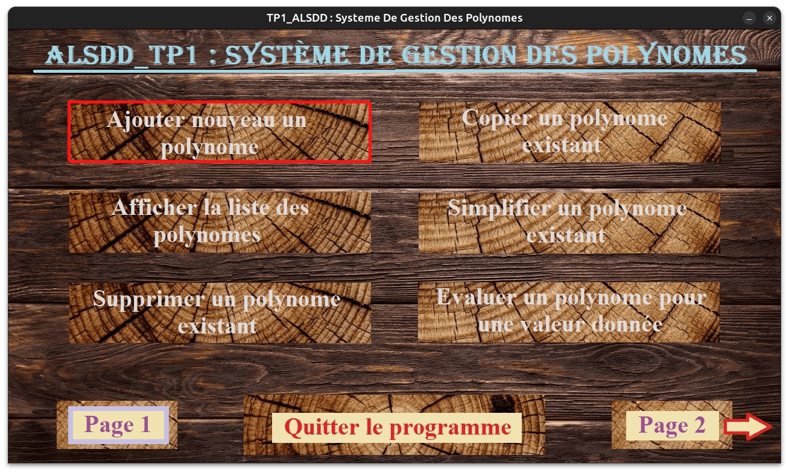

# polynomial-master

**A C project for manipulating polynomials using linked lists**

### Introduction
This project, initially developed for a university assignment, empowers you to explore linked lists and their application to complex polynomial operations. It has since been significantly enhanced to provide a robust development environment:
- Streamlined Workflow: CMake integration ensures seamless cross-platform compatibility for building the project.
- Enhanced Code Structure: Refactored code promotes readability, maintainability, and modularity.
- Dockerized Deployment: The included Dockerfile simplifies deployment by packaging the project into a container.


### Features
- Polynomial Arithmetic: Perform essential operations like addition, subtraction, multiplication, division, evaluation, differentiation, and integration on polynomials.
- Efficient Representation: Leverage linked lists to represent polynomials effectively, optimizing memory management.
- Visualized Insights: Generate graphs of polynomials using the SDL2 library, providing a clear understanding of their behavior.
- CRC Calculation (Optional): Implement CRC (Cyclic Redundancy Check) to detect errors in data transmission (documentation required).


### Getting Started
#### Prerequisites:
For a traditional build, ensure you have CMake, SDL2, SDL2_image, and SDL2_ttf libraries installed on your system. Refer to your system's package manager for installation instructions.

#### Alternatively:
For a more convenient setup, leverage the provided Dockerfile to run the project in a container. This approach eliminates the need for specific library installations.

### Building and Running (Traditional Method):
1. **Clone the repository:**
   ```bash
    git clone https://github.com/lyes-mersel/polynomial-master.git
    ```
2. **Build the project:**
    ```bash
    cd polynomial-master && mkdir build && cd build
    cmake ..
    make
    ```
3. **Run the application:**
    ```bash
    ./polynomial-master
    ```

### Using Docker (Simplified Method):
1. **Clone the repository:**
    ```bash
    git clone https://github.com/lyes-mersel/polynomial-master.git
    ```
2. **Build the image:**
    ```bash
    cd polynomial-master
    docker build -t polynomial-master .
    ```
3. **Run the container:**
    **Unix-based system (Debian, Ubuntu, Mint, macOS, ...):**
    ```bash
    docker run --rm -it --device /dev/dri -e DISPLAY=:0 --volume /tmp/.X11-unix:/tmp/.X11-unix polynomial-master
    ```
    **Windows (requires Xming server):**
    ```bash
    docker run --rm -it -e DISPLAY=:0 --volume /tmp/.X11-unix:/tmp/.X11-unix polynomial-master
    ```

#### Note:
For Windows users running the container, installing and launching the Xming server is a prerequisite.


## Screenshots
|  |  |  |
| -------| ------- | ------- |
|  |  |  |
|  |  |  |


## Project Components
- **C Programming Language:** Forms the foundation for the project's functionalities.
- **CMake:** Streamlines the build process across different platforms.
- **SDL2, SDL2_image, SDL2_ttf:** Libraries utilized for graphics and user interface elements.


## Developer Information
- Website - [Portfolio](https://lyes-mersel.netlify.app)
- Github - [@lyes-mersel](https://github.com/lyes-mersel)
- LinkedIn - [@lyes-mersel](https://www.linkedin.com/in/lyes-mersel/)


## Made with ❤️ for Efficient Polynomial Manipulation
